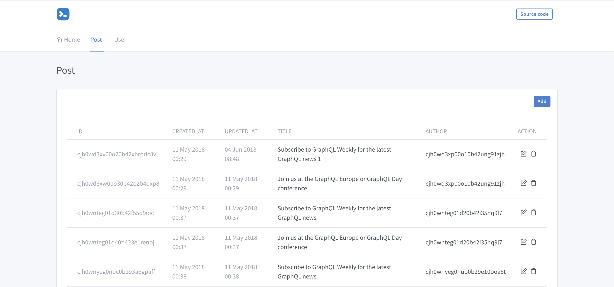

# Prisma Admin


A clean admin panel UI to manage prisma's graphql API

### Getting started

```
yarn global add prisma-admin
prisma-admin PRISMA_ENDPOINT
```

### Development
To start the development server,
```
git clone https://github.com/somus/prisma-admin.git
cd prisma-admin
yarn install
yarn start
```

### TODO
- [x] Support for list fields
- [ ] Add tests